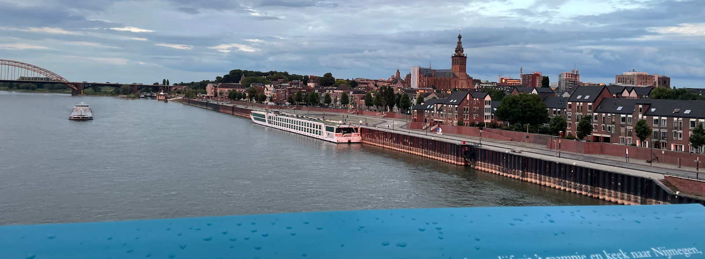
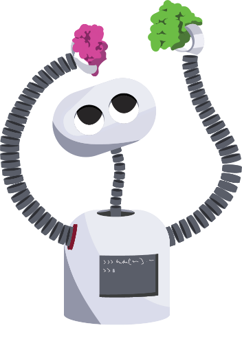

# CSI2025

{ width="100%" }

!!!- Info "Time, Location & Schedule"
    2-4 September 2025

    [Radboudumc Experience Center, Geert Grooteplein Noord 15, 6525 EZ Nijmegen, Netherlands](https://maps.app.goo.gl/etGkW1uio78HrV9f7)

    [Check the detailed schedule](schedule.md)

Deciphering T-cell receptor (TCR) specificity relies on understanding their three-dimensional (3D) structures. However, even in the post-AlphaFold era, modeling `TCR–peptide–MHC` complexes remains a major challenge. Together with [Johannes Textor](https://www.linkedin.com/in/johannes-textor-28b168256/), [Erik Bekkers](https://www.linkedin.com/in/erik-bekkers-ba31a396/) and [Jolanda de Vries](https://www.linkedin.com/in/jolanda-de-vries-31a54816/), our [Structural Bioinformatics Lab at Radboudumc](https://www.radboudumc.nl/en/research/research-groups/structural-bioinformatics) is proud to host the first Computational Structural Immunology Symposium, to foster interdisciplinary dialogue among experts in  **T-cell immunity**, **geometric deep learning**, and **protein structure modeling**, advancing our ability to predict T cell specificity and beyond.

## Organizing committee

| Name | Research | Affiliation |
|------|-----------|-------------|
| **Li Xue** | Structural Bioinformatics | Radboudumc |
| **Hanka Venselaar** | Structural Bioinformatics | Radboudumc |
| **Johannes Textor** | Computational Immunology | Radboud University |
| **Erik Bekkers** | Geometric Deep Learning | University of Amsterdam |
| **Gerty Schreibelt** | Translational Immunology | Radboudumc |
| **Dario Marzella** | Structural Bioinformatics | Radboudumc |
| **Mark Gorris** | Cancer Vaccine | Radboudumc |
| **Cunliang Geng** | Structural Bioinformatics | Netherlands eScience Center |

Administrative Support: **Janneke Hermens**, Radboudumc

## Sponsor

[{ width="30%" }](https://www.esciencecenter.nl/)

## Speakers

-   { width="120" }

    **Speaker 1**

    *Affiliation*

    [:material-web: Website](https://example.com) · [:material-linkedin: LinkedIn](https://linkedin.com/in/...) · [:material-github: GitHub](https://github.com/...)

-   { width="120" }

    **Speaker 2**

    *Affiliation*

    [:material-web: Website](https://example.com) · [:material-linkedin: LinkedIn](https://linkedin.com/in/...) · [:material-github: GitHub](https://github.com/...)

-   { width="120" }

    **Speaker 3**

    *Affiliation 3*

    [:material-web: Website](https://example.com) · [:material-linkedin: LinkedIn](https://linkedin.com/in/...) · [:material-github: GitHub](https://github.com/...)

-   { width="120" }

    **Speaker 4**

    *Affiliation 4*

    [:material-web: Website](https://example.com) · [:material-linkedin: LinkedIn](https://linkedin.com/in/...) · [:material-github: GitHub](https://github.com/...)

-   { width="120" }

    **Speaker 5**

    *Affiliation 5*

    [:material-web: Website](https://example.com) · [:material-linkedin: LinkedIn](https://linkedin.com/in/...) · [:material-github: GitHub](https://github.com/...)

-   { width="120" }

    **Speaker 6**

    *Affiliation 6*

    [:material-web: Website](https://example.com) · [:material-linkedin: LinkedIn](https://linkedin.com/in/...) · [:material-github: GitHub](https://github.com/...)

-   { width="120" }

    **Speaker 7**

    *Affiliation 7*

    [:material-web: Website](https://example.com) · [:material-linkedin: LinkedIn](https://linkedin.com/in/...) · [:material-github: GitHub](https://github.com/...)

-   { width="120" }

    **Speaker 8**

    *Affiliation 8*

    [:material-web: Website](https://example.com) · [:material-linkedin: LinkedIn](https://linkedin.com/in/...) · [:material-github: GitHub](https://github.com/...)

-   { width="120" }

    **Speaker 9**

    *Affiliation 9*

    [:material-web: Website](https://example.com) · [:material-linkedin: LinkedIn](https://linkedin.com/in/...) · [:material-github: GitHub](https://github.com/...)

-   { width="120" }

    **Speaker 10**

    *Affiliation 10*

    [:material-web: Website](https://example.com) · [:material-linkedin: LinkedIn](https://linkedin.com/in/...) · [:material-github: GitHub](https://github.com/...)

-   { width="120" }

    **Speaker 11**

    *Affiliation 11*

    [:material-web: Website](https://example.com) · [:material-linkedin: LinkedIn](https://linkedin.com/in/...) · [:material-github: GitHub](https://github.com/...)

-   { width="120" }

    **Speaker 12**

    *Affiliation 12*

    [:material-web: Website](https://example.com) · [:material-linkedin: LinkedIn](https://linkedin.com/in/...) · [:material-github: GitHub](https://github.com/...)

## Map

<iframe
  src="https://umap.openstreetmap.fr/en/map/via-egnatia-from-kavala-harbor-to-the-east-gate-of_1270001?scaleControl=false&miniMap=false&scrollWheelZoom=false&zoomControl=true&editMode=disabled&moreControl=true&searchControl=null&tilelayersControl=null&embedControl=null&datalayersControl=true&onLoadPanel=none&captionBar=false&captionMenus=true"
  width="100%" height="500" frameborder="0" allowfullscreen>
</iframe>
