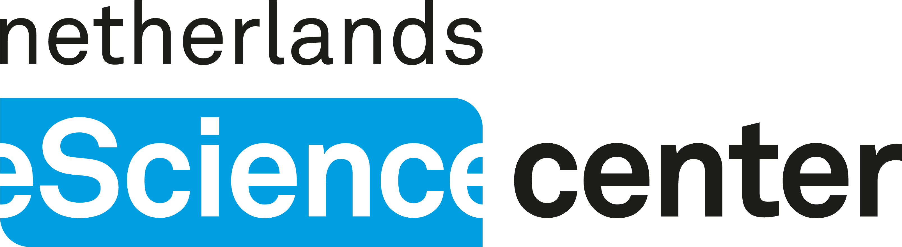
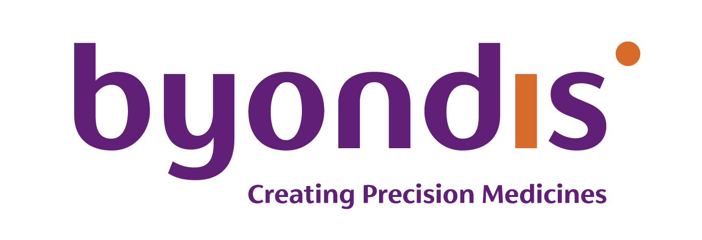

# Schedule

📍 <strong>Location:</strong> <a href="https://maps.app.goo.gl/etGkW1uio78HrV9f7" target="_blank">Radboudumc Experience Center, Geert Grooteplein Noord 15, 6525 EZ Nijmegen, Netherlands</a>

<table class="schedule-table day-overview">
<thead>
<tr>
<th>Day</th>
<th>Time</th>
<th>Room</th>
<th>Topic</th>
</tr>
</thead>
<tbody>
<tr>
<td><strong><a href="#day-1-computational-immunity">Day 1</a></strong> <em>Sep. 2nd</em></td>
<td>14:30-18:00</td>
<td>Waalbrug B</td>
<td>🧬 Computational immunity</td>
</tr>
<tr>
<td><strong><a href="#day-2-ai-and-3d-modelling">Day 2</a></strong> <em>Sep. 3rd</em></td>
<td>9:30-16:30</td>
<td>Waalbrug B (main) De Oversteek (parallel talk)</td>
<td>🤖 Geometric deep learning & 3D modelling + outing</td>
</tr>
<tr>
<td><strong><a href="#day-3-t-cell-immunity-and-therapy">Day 3</a></strong> <em>Sep. 4th</em></td>
<td>9:30-17:35</td>
<td>Auditorium</td>
<td>🔬 T-cell immunity and therapy</td>
</tr>
</tbody>
</table>

## Day 1: Computational Immunity (Room: Waalbrug B) {#day-1-computational-immunity}

<table class="schedule-table">
<thead>
<tr>
<th>Time</th>
<th>Event</th>
</tr>
</thead>
<tbody>
<tr>
<td class="time-cell">14:30-15:00</td>
<td>📋 Registration<strong>Register and coffee</strong></td>
</tr>
<tr>
<td class="time-cell">15:00-15:05</td>
<td>🎯 Opening<strong>Opening</strong></td>
</tr>
<tr>
<td class="time-cell">15:05-16:45</td>
<td>
🎤 Invited Talks<strong>Invited talks:</strong> 
Session chairs: Johannes Textor, Dario Marzella  

David Gfeller (UNIL) (35+5 min) 

Predicting TCR-peptide-MHC interactions - How can we bridge the two sides of the equation

 

Vincent Zoete (UNIL) (25+5 min) 

Computer-aided Molecular Engineering

 

Li Xue (Radboudumc) (20+5 min) 

AI-boosted 3D modelling for cancer immunotherapy

</td>
</tr>
<tr>
<td class="time-cell">16:45-17:15</td>
<td>☕ Break<strong>Coffee break, snacks</strong></td>
</tr>
<tr>
<td class="time-cell">17:15-17:45</td>
<td>
⚡ Flash Talks<strong>Flash talks (12+3 min/talk):</strong> 
Session chair: Li Xue, Jan Aarts  

Cunliang Geng (NLeSc) 

DeepRank2 - a python framework for mining 3D protein structures with geometric deep learning

 

Mihaela Mihaylova (Radboud) 

Human-in-the-loop approach for less laborious cell tracking

</td>
</tr>
</tbody>
</table>

## Day 2: AI and 3D modelling (Room: Waalbrug B) {#day-2-ai-and-3d-modelling}

<table class="schedule-table">
<thead>
<tr>
<th>Time</th>
<th>Event</th>
</tr>
</thead>
<tbody>
<tr>
<td class="time-cell">9:30-10:00</td>
<td>📋 Registration<strong>Register/coffee</strong></td>
</tr>
<tr>
<td class="time-cell">10:00-10:45</td>
<td>
⚡ Parallel Flash Talks<strong>Parallel flash talks (Two rooms, 12+3 min/talk):</strong>  
<strong> ⭐ AI on 3D (Room: Waalbrug B):</strong> 
Session chairs: Erik Bekkers, Li Xue  

Riza Özçelik (TU/e) 

Look the Other Way: Designing 'Positive' Molecules with Negative Data via Task Arithmetic

 

Rens den Braber (UvA) 

AI-based energy predictor for conformation sampling

 

Amelia Villegas-Morcillo (TU Delft) 

All-atom and structure-aware generative design of immunoproteins using diffusion models

 
<strong> 🌟 AI for cancer immunotherapies (Room: De Oversteek):</strong> 
Session chair: Daniel Rademaker, Danielle Diepenbroek  

Dario Marzella (Radboudumc) 

Using 3D structure and geometric deep learning to improve epitope predictions

 

Farzaneh Meimandi Parizi (Radboud) 

SwiftTCR: Efficient computational docking protocol of TCRpMHC-I complexes using restricted rotation matrices

 

David Frühbuß (Max Planck) 

MHC-Diff: Fast and Accurate Peptide–MHC Structure Prediction via an Equivariant Diffusion Model

 
</td>
</tr>
<tr>
<td class="time-cell">10:45-11:15</td>
<td>☕ Break<strong>Coffee break</strong></td>
</tr>
<tr>
<td class="time-cell">11:15-12:05</td>
<td>
🎤 Invited Talks<strong>Invited talks (Room: Waalbrug B, 20+5 min/talk):</strong> 
Session chairs: Martijn Huijnen, Dario Marzella  

Johannes Textor (Radboud University) 

How T cells coordinate their motion in single lane traffic

 

Yang Yang (Shanghai Jiaotong Univ) 

EPIC: Multi-objective Guided Diffusion for Epitope Design in TCR-pMHC Complexes

</td>
</tr>
<tr>
<td class="time-cell">12:05-13:30</td>
<td>🍽️ Lunch<strong>Lunch and poster session</strong></td>
</tr>
<tr>
<td class="time-cell">13:30-14:45</td>
<td>
🎤 Invited Talks <strong>Geometric deep learning (30+5 min/talk):</strong> 
Session chair: Li Xue, David Frühbuß   

Erik Bekkers (UvA) 

Equivariance and weight-sharing in neural networks without specialized modules

 

Artem Moskalev (Johnson&Johnson)
<!-- 
Language and Geometry models for RNA

 

Cong Liu (UvA) 

Geometric Modelling with Clifford Algebra for Molecules and Proteins

 -->
</td>
</tr>
<tr>
<td class="time-cell">14:45-15:15</td>
<td>☕ Break<strong>Coffee break</strong></td>
</tr>
<tr>
<td class="time-cell">15:15-16:30</td>
<td>
🎤 Invited Talks<strong>3D modelling and design (20+5 min/talk):</strong> 
Session chairs: Hanka Venselaar, Coos Baakman  

Monica Fernandez-Quintero (Scripps) 

Structure and dynamics-guided antibody design

 

Hashem Koohy (Oxford) 

Decoding Antigen Recognition Through Structural Modelling of TCR:pMHC complexes

 

Danny Sahtoe (Hubrecht Institute) 

Design of conformational and epigenetic control systems

</td>
</tr>
<tr>
<td class="time-cell">17:15-19:15</td>
<td>🚶‍♀️ Outing<strong>Outing - Historical walk of Nijmegen (starting point: Central Station Nijmegen)</strong> 
Sponsored by Byondis
</td>
</tr>
<tr>
<td class="time-cell">19:30</td>
<td>🍽️ Dinner<strong>Dinner with speakers and organizers @ Waagh restaurant (invitation only)</strong></td>
</tr>
</tbody>
</table>

## Day 3: T cell immunity and therapy (Room: Auditorium) {#day-3-t-cell-immunity-and-therapy}

<table class="schedule-table">
<thead>
<tr>
<th>Time</th>
<th>Event</th>
</tr>
</thead>
<tbody>
<tr>
<td class="time-cell">9:30-10:00</td>
<td>📋 Registration<strong>Register/coffee</strong></td>
</tr>
<tr>
<td class="time-cell">10:00-11:30</td>
<td>
🎤 Invited Talks<strong>Invited speakers (25+5 min/talk):</strong> 
Session chairs: Mark Gorris, Asima Abidi  

Heather Melichar (McGill) 

Predicting T cell responses from intracellular calcium dynamics

 

Sonja Bushow (Erasmus MC) 

Immunopeptidomics in chronic HBV infection for therapeutic vaccine design

 

Ludger Klein (LMU Munich) 

Role of B cells in central T cell tolerance

</td>
</tr>
<tr>
<td class="time-cell">11:30-13:00</td>
<td>🍽️ Lunch<strong>Lunch and poster session</strong></td>
</tr>
<tr>
<td class="time-cell">13:00-14:30</td>
<td>
🎤 Invited Talks<strong>Invited speakers (25+5 min/talk):</strong> 
Session chairs: Heather Melichar, Sonja Buschow  

Mark Gorris (Radboudumc) 

Induction of Frameshift-specific T cells through Dendritic Cell Vaccination in Lynch Syndrome and CMMRD

 

Timo van den Berg (Byondis & Radboudumc, antibody therapy) 

Therapeutic targeting of the CD47-SIRPα myeloid immune checkpoint in cancer with the anti-SIRPα antibody BYON4228

 

Raquel Cuella Martin (McGill) 

High-throughput precision gene editing to systematically characterize unusual protein-protein interactions

</td>
</tr>
<tr>
<td class="time-cell">14:30-15:00</td>
<td>☕ Break<strong>Coffee break</strong></td>
</tr>
<tr>
<td class="time-cell">15:00-16:15</td>
<td>
🎤 Invited Talks<strong>Invited speakers (20+5 min/talk):</strong> 
Session chairs: Farzaneh Meimandi Parizi, Mike Claassens  

Alexandre Bonvin (Utrecht University) 

AI and physics-based integrative modelling of immune complexes

 

Anna Vangone (Roche) 

Drug discovery in the era of AI

 

Guang Yang (Shanghai Tech) 

A broadly neutralizing antibody recognizing a unique epitope with a signature motif common across coronaviruses

</td>
</tr>
<tr>
<td class="time-cell">16:15-16:45</td>
<td>☕ Break<strong>Coffee break</strong></td>
</tr>
<tr>
<td class="time-cell">16:45-17:30</td>
<td>
⚡ Flash Talks<strong>Flash talks (12+3 min/talk):</strong> 
Session chairs: Raquel Cuella Martin, Gerty Schreibelt  

Thomas Kuilman (AstraZeneca) 

Establisment of a TCR Discovery Platform to support building ML models that predict TCR characteristics

 

Asima Abidi (Radboudumc) 

Characterization of TGF-BRII frameshift neoepitope specific T cell receptors for use in adoptive T cell therapy

 

Tom Hofland (Radboudumc) 

Retrotransposable elements as novel cancer-specific antigens

</td>
</tr>
<tr>
<td class="time-cell">17:30</td>
<td>🎯 Closing<strong>Closing remarks</strong></td>
</tr>
</tbody>
</table>

## Sponsors

[{ width="30%" }](https://www.esciencecenter.nl/)
[{ width="20%" }](https://www.byondis.com/)

## Host

[{ width="30%" }](https://www.radboudumc.nl/en/research/)